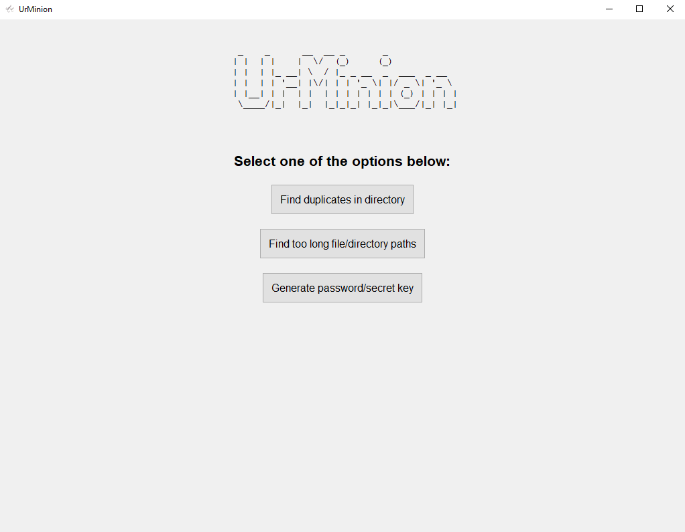
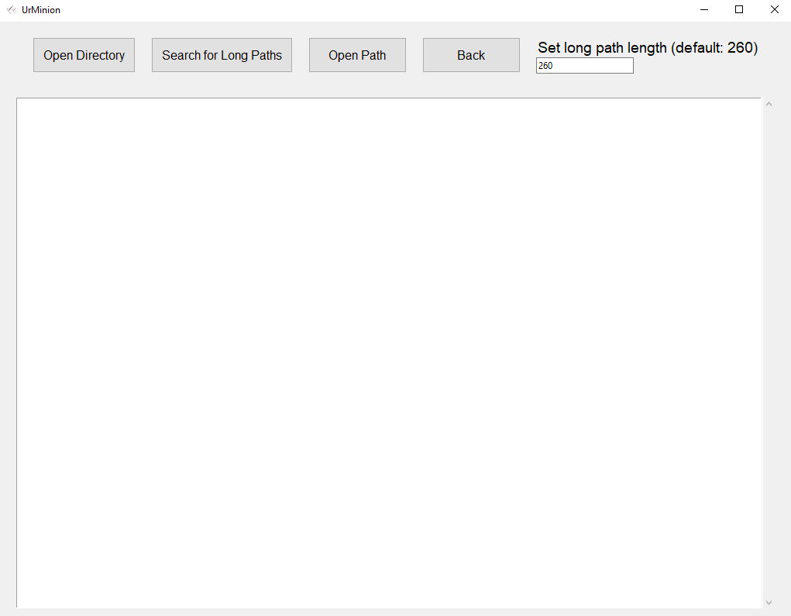
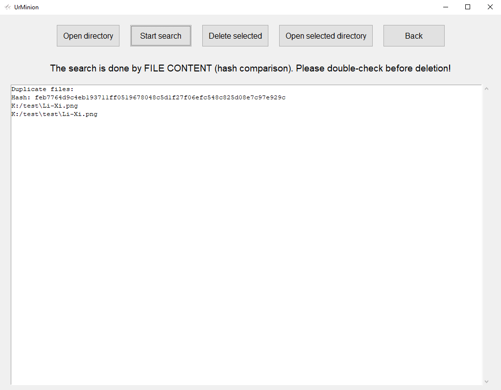

# UrMinion






This is a Python-based GUI application developed to provide utility tools such as detecting long file paths, generating secret keys, and finding duplicate files based on file hashes. The application is built using `tkinter`.

## Features

- **Secret Key Generator**: Generate secure random keys of customizable lengths and automatically copy them to the clipboard.
- **Long Path Finder**: Identify and list file paths that exceed 260 characters, which can be problematic for certain file systems.
- **Duplicate Finder**: Detect duplicate files within a selected directory.


## Technologies Used

- **Python 3.11**
- **Tkinter**: For the graphical user interface.

## Installation

1. Clone the repository:
   ```bash
   git clone https://github.com/draprar/tkinter-utility-tools_urminion.git
   cd tkinter-utility-tools_urminion
   ```

2. Install dependencies:
   ```bash
   pip install -r requirements.txt
   ```

3. Run the application:
   ```bash
   python main.py
   ```

## How to Use

### Secret Key Generator
1. Enter the desired number of characters for the secret key.
2. Click on "Generate and Copy" to create a random key and copy it to your clipboard.

### Long Path Finder
1. Click "Open Directory" to select a folder.
2. Click "Search for Long Paths" to list file paths that exceed 260 characters.
3. Select any path from the list and click "Open Path" to open the folder in your file explorer.

### Duplicate File Finder
1. Open the duplicate finder tool and select the directory to search for duplicate files.
2. Click "Start Search" to identify and list duplicate files.

## Contributing

If you’d like to contribute to the project, feel free to submit a pull request. Make sure to adhere to the existing code style and include detailed explanations of your changes.

## **Credits**

- **Developer**: Walery ([@draprar](https://github.com/draprar/))
- **ASCII Art**: Custom-generated for this program.

## **CI/CD YAML FILE**
As I encountered a lot of problems while trying to properly configure the workflow for Github Actions - I'm sharing the content of my CI/CD file for Tkinter :)
   ```bash
   name: UrMinion

on:
  push:
    branches:
      - main
  pull_request:
    branches:
      - main

jobs:
  build:
    runs-on: ubuntu-latest

    steps:
      - name: Check out the repository
        uses: actions/checkout@v3

      - name: Set up Python
        uses: actions/setup-python@v4
        with:
          python-version: 3.11

      - name: Install dependencies
        run: |
          sudo apt-get update
          sudo apt-get install -y xvfb
          python -m pip install --upgrade pip
          python -m pip install pytest pytest-mock

        - name: Run Xvfb
        run: |
          Xvfb :99 -screen 0 1024x768x16 & # Start Xvfb
          sleep 5 # Set some time to start
          export DISPLAY=:99 # Set DISPLAY variable
          echo "Xvfb started on display $DISPLAY" # Logger

        - name: Run tests with pytest
        run: |
          export DISPLAY=:99
          python -m pytest tests/ --maxfail=1 # Set max fail to 1

   ```